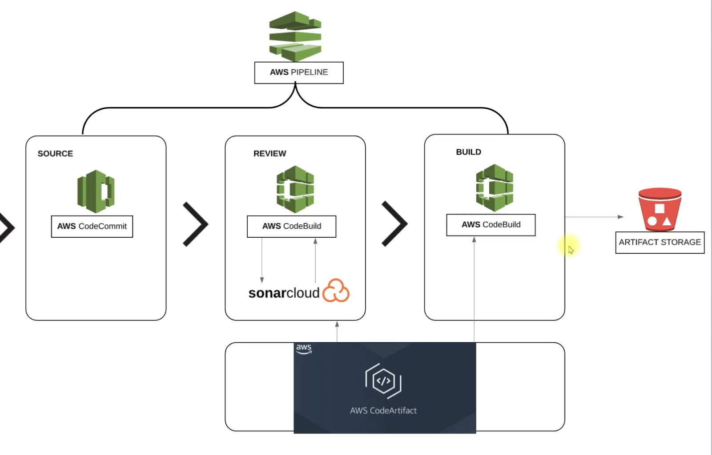

# Continuous Integration on AWS

Welcome to my **Continuous Integration on AWS** project!

In this repository, I show you how I set up and manage continuous integration (CI) pipelines using AWS services.

---

## Project Overview

In this project, I walk you through my process of implementing CI practices on AWS, leveraging cloud-native tools and best practices that I’ve found effective.

---

## Current Scenario & Problem

To set the stage, let me show you the current situation and the challenges I face before implementing CI on AWS. Here’s the context and motivation for this project:

### Scenario: Current Situation

In my Agile SDLC, developers (including myself) make regular code changes. Every commit needs to be built and tested to ensure quality.

Usually, the Build & Release team handles this, or sometimes it's up to us developers to merge and integrate code. This can get tricky and time-consuming!

### Problem: Issues with Current Situation

With frequent code changes, testing doesn't always keep up. This leads to bugs and errors piling up in the codebase.

We end up spending time reworking code to fix bugs, dealing with manual build and release processes, and managing inter-team dependencies. It slows us down and makes collaboration harder.

### Solution: My Fix

My answer is to build and test every commit automatically, streamline the process, and get notified for every build status. This is where AWS-powered CI comes in!

---

## Flow of Execution

Here’s how I execute my CI pipeline setup on AWS, step by step:

### 1. Login to AWS Account
- I start by logging into my AWS account to access all the necessary services.

### 2. CodeCommit
- I create a CodeCommit repository to store my source code.
- I set up an IAM user with the required CodeCommit policy.
- I generate SSH keys locally and exchange them with the IAM user for secure access.
- I migrate my source code from GitHub to the CodeCommit repository and push it.

### 3. CodeArtifact
- I create an IAM user with access to CodeArtifact.
- I install and configure the AWS CLI on my machine.
- I export the authentication token for CodeArtifact.
- I update the `settings.xml` file in my source code’s top-level directory with the necessary details.
- I also update the `pom.xml` file with repository details for dependency management.

### 4. SonarCloud
- I create a SonarCloud account and generate a token for authentication.
- I store SonarCloud details as SSM parameters in AWS.
- I create a build project that integrates with SonarCloud.
- I update the CodeBuild role to access the SSM Parameter Store for secure credentials.

### 5. Notifications
- I set up notifications for build and deployment status using SNS or Slack, so I’m always in the loop.

### 6. Build Project
- I update the `pom.xml` file to include artifact versioning with a timestamp.
- I create variables in SSM Parameter Store for use in the build process.
- I create the build project in AWS CodeBuild.
- I update the CodeBuild role to access SSM Parameter Store as needed.

### 7. Create Pipeline
- I create a pipeline in AWS CodePipeline that connects all the stages:
  - CodeCommit (source)
  - Test code
  - Build
  - Deploy to an S3 bucket

### 8. Test Pipeline
- Finally, I test the pipeline to make sure everything works as expected from code commit to deployment.

---

## Visual Overview

Continuous Integration on AWS - Project Banner

---

## Table of Contents

- [Project Overview](#project-overview)
- [Current Scenario & Problem](#current-scenario--problem)
- [Visual Overview](#visual-overview)
- [Getting Started](#getting-started)
- [Architecture](#architecture)
- [CI Pipeline Steps](#ci-pipeline-steps)
- [AWS Services Used](#aws-services-used)
- [Contributing](#contributing)
- [License](#license)

---

## Getting Started

Here’s how I get things up and running:

1. **Clone the repository:**
   ```bash
   git clone https://github.com/yourusername/CI-on-AWS.git
   cd CI-on-AWS
   ```
   This is where I start my journey.

2. **Follow along with my documentation and images for step-by-step guidance.**
   I’ll keep updating this repo as I go, so you can see exactly how I build and refine my CI pipeline on AWS.

---

## Architecture

Here’s the architecture diagram for my CI pipeline on AWS. This visual shows how I’ve structured the flow from code commit to deployment, using various AWS services to automate and streamline the process:



---

## CI Pipeline Steps

I’ll document each step of my CI pipeline here, adding screenshots and explanations as I progress.

---

## AWS Services Used

Here are the AWS services I’m using in this project:

- AWS CodePipeline
- AWS CodeBuild
- AWS CodeCommit
- AWS S3
- AWS IAM
<!-- I’ll add more as needed -->

---


